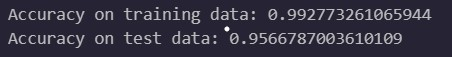

# Diabetes Prediction Using SVM
A machine learning project that predicts whether a patient is diabetic based on diagnostic measurements using a Support Vector Machine (SVM) classifier.

## Table of Contents

- [Overview](#overview)
- [Dataset](#dataset)
- [Libraries Used](#libraries-used)
- [Data Preprocessing](#data-preprocessing)
- [Machine Learning Model](#machine-learning-model)
- [Process](#process)
- [Model Evaluation](#model-evaluation)
- [Visualizations](#visualizations)
- [What I Learned](#what-i-learned-through-this-project)
- [Disclaimer](#disclaimer)

## Overview
This project uses the Diabetes Dataset from Kaggle to build a binary classification model.
The project covers data preprocessing, feature scaling, model training, prediction, evaluation, and visualization.
The model predicts whether a person is Diabetic or Non-Diabetic based on the given input

### NOTE: This is a simple educational model that can make errors and should not be used for real medical applications.

## Dataset
The dataset contains several medical diagnostic features:
- Pregnancies
- Glucose
- Blood Pressure
- Skin Thickness
- Insulin
- BMI
- Diabetes Pedigree Function
- Age

The target variable is 
- Outcome

## Libraries Used
- Python
- Pandas
- Matplotlib
- Seaborn
- Scikit-learn

## Data Preprocessing
The dataset was already divided into training and testing sets.
Feature scaling was performed using StandardScaler because SVM models are sensitive to differences in feature scales.
The scaler was fitted only on the training data and then used to transform the test data.

## Machine Learning Model
A Support Vector Machine (SVM) classifier with an RBF kernel was used.

## Process
1. Loading the required libraries and datasets into the notebook using pandas library
2. Analysis of data is done in this step and the dataset is combined into one dataframe for ease
3. Next, we standardized the data using **StandardScaler from Scikit-learn** to bring all input features to a similar scale, allowing the SVM model to evaluate them more effectively.
4. We divided the dataset into training and testing sets in ratio 80:20 with random state = 2. The training data was used to train the SVM model, while the testing data was used to evaluate its performance on unseen data.
5. A classifier SVM model is defined/created with RBF kernel, c=1 and gamma = 1 and the training data is added to train the data
6. Finally after the model is trained and we can use the model for prediction

## Visualizations
### Diabetes vs Non-Diabetes Patients

### Correlation Heatmap

### Correlation with Outcome

### Accuracy

## Model Evaluation
- Accuracy on training data: 99.28 %
- Accuracy on test data: 95.67 %

## What I Learned Through this project
- How to preprocess a dataset for machine learning
- How train/test splitting works
- Why feature scaling is important for SVM
- How SVM classification works
- How to evaluate a classification model
- How to visualize model predictions and errors

## Disclaimer
This project is for educational purposes only and should not be used as a medical diagnostic tool. You are free to use to understand the working of SVM.
